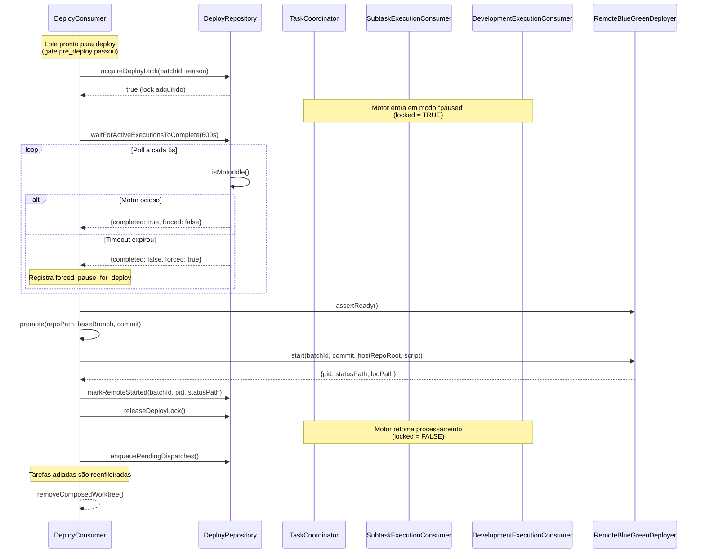

# Deploy Atômico — Motor v3

## Visão Geral

O deploy atômico garante que o motor pare de aceitar novas tarefas antes do deploy blue-green, aguarde as execuções em andamento terminarem (ou pause forçadamente após timeout), execute o deploy com segurança, e só depois retome o processamento.

**Motivação:** Antes do deploy atômico, o deploy blue-green rodava em paralelo com o motor processando análises e execuções. Quando o deploy terminava, o motor reiniciava e qualquer tarefa em andamento era perdida. Evidência: tarefa 873 estava em análise (contexto enviado, prompt pendente) quando o deploy da tarefa 895 terminou — o motor reiniciou e a sessão ficou órfã.

## Diagrama de Sequência



## Schema do Banco

Tabela `motor_deploy_lock` (singleton, id=1):

```sql
CREATE TABLE IF NOT EXISTS motor_deploy_lock (
  id INT PRIMARY KEY DEFAULT 1,
  locked BOOLEAN NOT NULL DEFAULT FALSE,
  locked_at TIMESTAMP NULL,
  locked_by VARCHAR(200) NULL,
  reason VARCHAR(500) NULL
) ENGINE=InnoDB DEFAULT CHARSET=utf8mb4 COLLATE=utf8mb4_unicode_ci;

INSERT IGNORE INTO motor_deploy_lock (id, locked) VALUES (1, FALSE);
```

**Migration:** `projects/gerenteagentes/migrations/0070_motor_deploy_lock.sql`

## Invariantes

### I1: Lock Exclusivo

**Invariant:** Apenas um batch pode adquirir o lock de deploy por vez.

**Garantia:** `acquireDeployLock()` usa `INSERT ON DUPLICATE KEY UPDATE` com verificação atômica:
- Se `locked = TRUE` e `locked_by ≠ batchId`, retorna `false` (lock já adquirido por outro batch).
- Se `locked = FALSE` ou `locked_by = batchId` (re-entrant), adquire/re-adquire o lock.

**Violação:** Se dois batches conseguirem adquirir o lock simultaneamente, o deploy blue-green pode rodar em paralelo, corrompendo o repo.

**Defesa:** Transação MySQL com `FOR UPDATE` garante serialização.

### I2: Motor Pausado Durante Deploy

**Invariant:** Enquanto `locked = TRUE`, consumidores de análise/subtarefa não aceitam trabalho novo.

**Garantia:** Consumidores verificam `isDeployLocked()` antes de processar:
- `TaskCoordinator.runAnalysis()`: rejeita com `reasonCode = 'deploy_in_progress'` e reenfileira.
- `SubtaskExecutionConsumer.handle()`: rejeita com `reasonCode = 'deploy_in_progress'` e reenfileira com delay de 30s.
- `DevelopmentExecutionConsumer.handle()`: rejeita com `reasonCode = 'deploy_in_progress'` e reenfileira com delay de 30s.

**Violação:** Se um consumidor aceitar trabalho durante o deploy, a tarefa pode ser perdida quando o motor reiniciar.

**Defesa:** Todos os consumidores chamam `isDeployLocked()` no início do `handle()`.

### I3: Lock Liberado em Caso de Falha

**Invariant:** O lock é liberado mesmo se o deploy falhar.

**Garantia:** `startPreparedBatch()` usa `try/catch/finally`:
```typescript
try {
  // ... deploy ...
  await this.repository.releaseDeployLock()
} catch (error) {
  await this.repository.releaseDeployLock() // Libera lock antes de propagar erro
  throw error
}
```

**Violação:** Se o lock não for liberado após falha, o motor fica permanentemente pausado.

**Defesa:** `releaseDeployLock()` é chamado no `catch` e no fluxo normal.

### I4: Timeout de Espera por Execuções Ativas

**Invariant:** O deploy aguarda no máximo 10 minutos (600s) por execuções ativas antes de prosseguir forçadamente.

**Garantia:** `waitForActiveExecutionsToComplete(timeoutMs)` faz poll de `isMotorIdle()` a cada 5s:
- Se motor ficar ocioso antes do timeout: retorna `{completed: true, forced: false}`.
- Se timeout expirar: retorna `{completed: false, forced: true}` e registra evento `forced_pause_for_deploy`.

**Violação:** Se o deploy aguardar indefinidamente, o pipeline de deploy fica travado.

**Defesa:** Timeout configurável via `MOTOR_DEPLOY_TIMEOUT_MS` (default: 10 min).

### I5: Tarefas Adiadas São Retomadas

**Invariant:** Após o deploy, tarefas que foram reenfileiradas durante o lock são retomadas.

**Garantia:** `startPreparedBatch()` chama `enqueuePendingDispatches()` após liberar o lock:
```typescript
await this.repository.releaseDeployLock()
await this.repository.enqueuePendingDispatches()
```

**Violação:** Se tarefas adiadas não forem retomadas, elas ficam permanentemente pendentes.

**Defesa:** `enqueuePendingDispatches()` consulta mensagens com `reasonCode = 'deploy_in_progress'` e as reenfileira.

## Timeout Configuration

| Parâmetro | Valor Default | Variável de Ambiente | Descrição |
|-----------|---------------|----------------------|-----------|
| Timeout de espera por execuções ativas | 600s (10 min) | `MOTOR_DEPLOY_TIMEOUT_MS` | Tempo máximo que o deploy aguarda o motor ficar ocioso antes de prosseguir forçadamente. |
| Intervalo de poll | 5s | — | Intervalo entre verificações de `isMotorIdle()`. |
| Delay de reenfileiramento | 30s | — | Delay aplicado a mensagens reenfileiradas durante o lock. |

**Ajustar timeout:**
```bash
# No .env do motor-v3:
MOTOR_DEPLOY_TIMEOUT_MS=900000  # 15 minutos
```

## Recovery Procedures

### Cenário 1: Deploy Falha e Lock Não Liberado

**Sintoma:** `motor_deploy_lock.locked = TRUE` após deploy falhar; motor não aceita novas tarefas.

**Diagnóstico:**
```bash
# Verificar estado do lock
docker exec biblioteca-global-mysql-1 mysql -u root -proot projeto_640 \
  -e "SELECT * FROM motor_deploy_lock;"

# Verificar logs do motor
docker logs biblioteca-green-api-1 | grep "deploy_lock_released"
```

**Recuperação:**
```bash
# Liberar lock manualmente (último recurso)
docker exec biblioteca-global-mysql-1 mysql -u root -proot projeto_640 \
  -e "UPDATE motor_deploy_lock SET locked = FALSE, locked_at = NULL, locked_by = NULL, reason = NULL WHERE id = 1;"

# Reiniciar motor para retomar tarefas adiadas
docker restart biblioteca-green-api-1
```

**Causa raiz:** `releaseDeployLock()` não foi chamado (ex.: crash do processo antes do `catch`).

### Cenário 2: Timeout Expirou e Deploy Prosseguiu Forçadamente

**Sintoma:** Evento `forced_pause_for_deploy` nos logs; tarefas em andamento foram perdidas.

**Diagnóstico:**
```bash
# Verificar logs do motor
docker logs biblioteca-green-api-1 | grep "forced_pause_for_deploy"

# Verificar tarefas órfãs
docker exec biblioteca-global-mysql-1 mysql -u root -proot projeto_640 \
  -e "SELECT id, external_id, status FROM tarefas WHERE status IN ('running', 'analyzing') AND updated_at < NOW() - INTERVAL 1 HOUR;"
```

**Recuperação:**
```bash
# Reenfileirar tarefas órfãs (se houver)
curl -X POST http://localhost:3010/api/motor/recover-orphan-tasks

# Ou manualmente: atualizar status para 'pending' e reenfileirar
docker exec biblioteca-global-mysql-1 mysql -u root -proot projeto_640 \
  -e "UPDATE tarefas SET status = 'pending' WHERE id IN (873, 874);"
```

**Prevenção:** Aumentar `MOTOR_DEPLOY_TIMEOUT_MS` se tarefas longas são comuns.

### Cenário 3: Lock Adquirido por Batch Obsoleto

**Sintoma:** `locked_by` aponta para batch que não existe mais; motor permanentemente pausado.

**Diagnóstico:**
```bash
# Verificar lock
docker exec biblioteca-global-mysql-1 mysql -u root -proot projeto_640 \
  -e "SELECT * FROM motor_deploy_lock;"

# Verificar se batch ainda existe
docker exec biblioteca-global-mysql-1 mysql -u root -proot projeto_640 \
  -e "SELECT * FROM deploy_batches WHERE batch_id = '<locked_by>';"
```

**Recuperação:**
```bash
# Liberar lock se batch não existe
docker exec biblioteca-global-mysql-1 mysql -u root -proot projeto_640 \
  -e "UPDATE motor_deploy_lock SET locked = FALSE WHERE locked_by = '<batch_obsoleto>';"
```

**Prevenção:** Implementar reconciliador que verifica se `locked_by` ainda existe (feature futura).

## Testes de Integração

Os testes de integração estão em `test/deploy-consumer-atomic.test.ts` e cobrem:

1. **Fluxo normal:** acquireLock → waitForIdle → deploy → releaseLock → resumeTasks.
2. **Timeout expirado:** registra `forced_pause_for_deploy` e continua o deploy.
3. **Falha de deploy:** libera lock no `catch` antes de propagar erro.
4. **Lock já adquirido:** rejeita aquisição se outro batch já possui o lock.
5. **Análise em andamento:** simula análise que termina antes do timeout (completed=true, forced=false).

**Executar testes:**
```bash
cd projects/gerenteagentes/motor-v3
npm test -- deploy-consumer-atomic.test.ts
```

## Monitoramento

### Métricas

```bash
# Estado do lock
curl http://localhost:3010/api/motor/deploy-lock

# Tarefas adiadas (reasonCode = 'deploy_in_progress')
curl http://localhost:3010/api/motor/stats | jq .deferredTasks
```

### Logs

Eventos registrados no `OperationLogger`:
- `deploy_lock_acquired`: lock adquirido com sucesso.
- `deploy_wait_completed`: espera por execuções ativas terminou.
- `forced_pause_for_deploy`: timeout expirou, deploy prosseguiu forçadamente.
- `deploy_lock_released`: lock liberado (sucesso ou falha).

**Exemplo:**
```json
{
  "phase": "deploy_lock_acquired",
  "outcome": "succeeded",
  "batchId": "batch-123",
  "timestamp": "2026-09-25T21:52:32.000Z"
}
```

## Referências

- **Implementação:** `src/deploy/DeployConsumer.ts` (método `startPreparedBatch`)
- **Repositório:** `src/deploy/DeployRepository.ts` (métodos `acquireDeployLock`, `releaseDeployLock`, `waitForActiveExecutionsToComplete`)
- **Migration:** `projects/gerenteagentes/migrations/0070_motor_deploy_lock.sql`
- **Testes:** `test/deploy-consumer-atomic.test.ts`
- **Deploy blue-green:** `docs/DEPLOY.md`

## Histórico

- **2026-09-25:** Implementado deploy atômico após incidente da tarefa 873 (análise perdida durante deploy).
- **2026-09-25:** Migration 0070 criada para tabela `motor_deploy_lock`.
- **2026-09-25:** Consumidores atualizados para verificar `isDeployLocked()` antes de aceitar trabalho.
